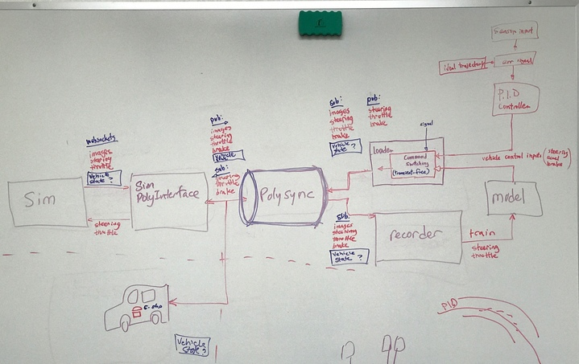
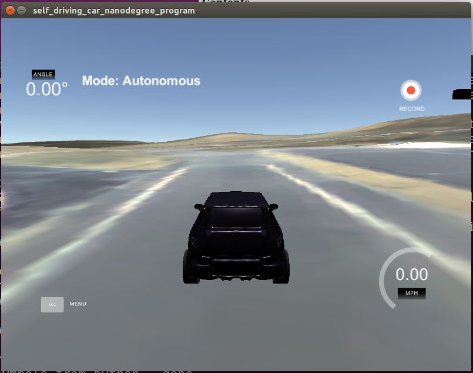
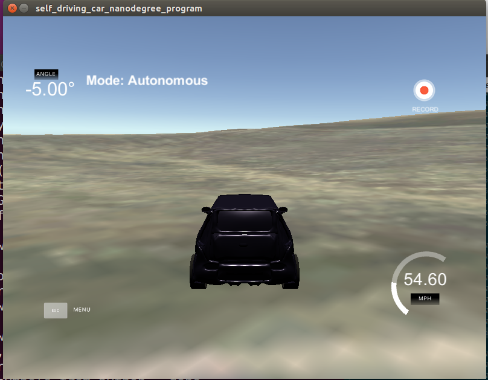

# SimInterface

An Initial Python wrapper for Polysync Core and Connector for Udacity Simulator.  This is work in progress.  The simulator images are being forwarded as MJPEG in Polysync.

## Initial Architecture



## Installation (Debug Version)

```
$ cd UdacitySim/SimNode/
$ cmake -DCMAKE_BUILD_TYPE=Debug .
$ make
$ cd ../TestClientNode
$ cmake -DCMAKE_BUILD_TYPE=Debug .
$ make
```

## Test Run (Use this order)

1. Start SimNode (Simulator Connector to Polysync):
```
$~/SDCND/thunderhill-racing/SimInterface$ ls
driveNode.py  README.md  testclient.py  UdacitySim
$~/SDCND/thunderhill-racing/SimInterface$ gdb python
GNU gdb (Ubuntu 7.11.1-0ubuntu1~16.04) 7.11.1
Copyright (C) 2016 Free Software Foundation, Inc.
License GPLv3+: GNU GPL version 3 or later <http://gnu.org/licenses/gpl.html>
This is free software: you are free to change and redistribute it.
There is NO WARRANTY, to the extent permitted by law.  Type "show copying"
and "show warranty" for details.
This GDB was configured as "x86_64-linux-gnu".
Type "show configuration" for configuration details.
For bug reporting instructions, please see:
<http://www.gnu.org/software/gdb/bugs/>.
Find the GDB manual and other documentation resources online at:
<http://www.gnu.org/software/gdb/documentation/>.
For help, type "help".
Type "apropos word" to search for commands related to "word"...
Reading symbols from python...done.
(gdb) run SimNode.py
Starting program: /home/jchen/anaconda3/envs/tensorflow/bin/python SimNode.py
[Thread debugging using libthread_db enabled]
Using host libthread_db library "/lib/x86_64-linux-gnu/libthread_db.so.1".
[New Thread 0x7fffb84e3700 (LWP 24847)]
[New Thread 0x7fffb5ce2700 (LWP 24848)]
[New Thread 0x7fffb34e1700 (LWP 24849)]
[New Thread 0x7fffb0ce0700 (LWP 24850)]
[New Thread 0x7fffb04df700 (LWP 24851)]
[New Thread 0x7fffabcde700 (LWP 24852)]
[New Thread 0x7fffa94dd700 (LWP 24853)]
[Thread 0x7fffa94dd700 (LWP 24853) exited]
[Thread 0x7fffabcde700 (LWP 24852) exited]
[Thread 0x7fffb04df700 (LWP 24851) exited]
[Thread 0x7fffb0ce0700 (LWP 24850) exited]
[Thread 0x7fffb34e1700 (LWP 24849) exited]
[Thread 0x7fffb5ce2700 (LWP 24848) exited]
[Thread 0x7fffb84e3700 (LWP 24847) exited]
[New Thread 0x7fffa94dd700 (LWP 24855)]
(24840) wsgi starting up on http://0.0.0.0:4567
2017-03-13 18:03:36.03s DEBUG  [sim-node-cpp-] - build version 2.0.10-1487272519
[New Thread 0x7ffff7fec700 (LWP 24856)]
[New Thread 0x7ffff7e30700 (LWP 24857)]
[New Thread 0x7ffff7e1f700 (LWP 24858)]
[New Thread 0x7ffff7e0e700 (LWP 24859)]
[New Thread 0x7fff9d238700 (LWP 24860)]
[New Thread 0x7fff9d1b7700 (LWP 24861)]
[New Thread 0x7fff9d136700 (LWP 24862)]
[New Thread 0x7fff9d0b5700 (LWP 24863)]
[New Thread 0x7fffb550d700 (LWP 24864)]
[New Thread 0x7fffb54fc700 (LWP 24865)]
[New Thread 0x7fff9d034700 (LWP 24866)]
[New Thread 0x7fff9cd2a700 (LWP 24867)]
[New Thread 0x7fffb2cf8700 (LWP 24868)]
[New Thread 0x7fff9d507700 (LWP 24869)]
[New Thread 0x7fff9d4f6700 (LWP 24870)]
[New Thread 0x7fff9d4e5700 (LWP 24871)]
[New Thread 0x7fff9d4d4700 (LWP 24872)]
[New Thread 0x7fff9d4c3700 (LWP 24873)]
[New Thread 0x7fff9d4b2700 (LWP 24874)]
[New Thread 0x7fff9d4a1700 (LWP 24875)]
[New Thread 0x7fff9cc29700 (LWP 24876)]
[New Thread 0x7fff9cc18700 (LWP 24877)]
[New Thread 0x7fff9cc07700 (LWP 24878)]
[New Thread 0x7fff9cbf6700 (LWP 24879)]
[New Thread 0x7fff9cbe5700 (LWP 24880)]
2017-03-13 18:03:38.03s DEBUG  [sim-node-cpp-281475977965346] - created participant - GUID: 0x000100003BADEF22 d(281475977965346)
2017-03-13 18:03:38.03s DEBUG  [sim-node-cpp-281475977965346] - message types visible to this node: 47
2017-03-13 18:03:38.03s DEBUG  [sim-node-cpp-281475977965346] - transition to state: INIT - timestamp: 1489442618283845
[New Thread 0x7fffabcde700 (LWP 24881)]
[New Thread 0x7fffb04df700 (LWP 24882)]
2017-03-13 18:03:38.03s DEBUG  [sim-node-cpp-281475977965346] - transition to state: OK - timestamp: 1489442618285356
...
```
2. Start Udacity Simulator and enter into Autonomous Mode
 
**RECOMMEND 320x160 Resolution setting.  1920x600 will work but is SLOW**
The SimNode should display the following additional output:
```
(25129) accepted ('127.0.0.1', 42881)
connect  ee7fb72b2ec04992947341b96d62e03b
queue.Queue.put!   1
inq.qsize():  1
steering, throttle, braking: 0.0 0.0 -0.0
lat, lon: -122.33878999696043 39.537450001767134
requestSensorData called
image: <class 'PIL.JpegImagePlugin.JpegImageFile'>
image_array: <class 'numpy.ndarray'> (160, 320, 3)
queue.Queue.put!   1
inq.qsize():  1
steering, throttle, braking: 0.0 0.0 -0.0
lat, lon: -122.33878999696043 39.537450001767134
requestSensorData called
queue.Queue.put!   1
inq.qsize():  1
steering, throttle, braking: 0.0 0.0 -0.0
lat, lon: -122.33878999696043 39.537450001767134
requestSensorData called
queue.Queue.put!   1
inq.qsize():  1
...
```
3. Start testnode.py (from a another terminal)
```
$~/SDCND/thunderhill-racing/SimInterface$ gdb python
GNU gdb (Ubuntu 7.11.1-0ubuntu1~16.04) 7.11.1
Copyright (C) 2016 Free Software Foundation, Inc.
License GPLv3+: GNU GPL version 3 or later <http://gnu.org/licenses/gpl.html>
This is free software: you are free to change and redistribute it.
There is NO WARRANTY, to the extent permitted by law.  Type "show copying"
and "show warranty" for details.
This GDB was configured as "x86_64-linux-gnu".
Type "show configuration" for configuration details.
For bug reporting instructions, please see:
<http://www.gnu.org/software/gdb/bugs/>.
Find the GDB manual and other documentation resources online at:
<http://www.gnu.org/software/gdb/documentation/>.
For help, type "help".
Type "apropos word" to search for commands related to "word"...
pyton: No such file or directory.
(gdb) run testclient.py
Starting program: /home/jchen/anaconda3/envs/tensorflow/bin/python testclient.py
[Thread debugging using libthread_db enabled]
Using host libthread_db library "/lib/x86_64-linux-gnu/libthread_db.so.1".
[New Thread 0x7ffff2a66700 (LWP 25217)]
[New Thread 0x7ffff0265700 (LWP 25218)]
[New Thread 0x7fffeda64700 (LWP 25219)]
[New Thread 0x7fffeb263700 (LWP 25220)]
[New Thread 0x7fffe8a62700 (LWP 25221)]
[New Thread 0x7fffe6261700 (LWP 25222)]
[New Thread 0x7fffe3a60700 (LWP 25223)]
[Thread 0x7fffe3a60700 (LWP 25223) exited]
[Thread 0x7fffe6261700 (LWP 25222) exited]
[Thread 0x7fffe8a62700 (LWP 25221) exited]
[Thread 0x7fffeda64700 (LWP 25219) exited]
[Thread 0x7ffff0265700 (LWP 25218) exited]
[Thread 0x7ffff2a66700 (LWP 25217) exited]
[Thread 0x7fffeb263700 (LWP 25220) exited]
Using TensorFlow backend.
[New Thread 0x7fffe3a60700 (LWP 25228)]
[New Thread 0x7fffe6261700 (LWP 25229)]
[New Thread 0x7fffe8a62700 (LWP 25230)]
[New Thread 0x7fffeb263700 (LWP 25231)]
[New Thread 0x7fffb7429700 (LWP 25232)]
[New Thread 0x7fffb6c28700 (LWP 25233)]
[New Thread 0x7fffb6427700 (LWP 25234)]
[New Thread 0x7fffb5c26700 (LWP 25235)]
warning: the debug information found in "/usr/local/polysync/vendor/lib/libpcre.so.3.13.2" does not match "/usr/local/polysync/vendor/lib/libpcre.so.3" (CRC mismatch).
2017-03-13 18:21:40.03s DEBUG  [sim-test-client-cpp-] - build version 2.0.10-1487272519
[New Thread 0x7ffff7fec700 (LWP 25236)]
[New Thread 0x7ffff7e10700 (LWP 25237)]
[New Thread 0x7ffff63cc700 (LWP 25238)]
[New Thread 0x7fffed27e700 (LWP 25239)]
[New Thread 0x7fffa89c7700 (LWP 25240)]
[New Thread 0x7fffa8946700 (LWP 25241)]
[New Thread 0x7fffa88c5700 (LWP 25242)]
[New Thread 0x7fffa8844700 (LWP 25243)]
[New Thread 0x7fffbfc3c700 (LWP 25244)]
[New Thread 0x7fffbfc2b700 (LWP 25245)]
[New Thread 0x7fffa87c3700 (LWP 25246)]
[New Thread 0x7fffa84b9700 (LWP 25247)]
[New Thread 0x7fffbfc1a700 (LWP 25248)]
[New Thread 0x7fffa83b8700 (LWP 25249)]
[New Thread 0x7fffa83a7700 (LWP 25250)]
[New Thread 0x7fffa8396700 (LWP 25251)]
[New Thread 0x7fffa8385700 (LWP 25252)]
[New Thread 0x7fffa8374700 (LWP 25253)]
[New Thread 0x7fffa8363700 (LWP 25254)]
[New Thread 0x7fffa8352700 (LWP 25255)]
[New Thread 0x7fffa8341700 (LWP 25256)]
[New Thread 0x7fffa8330700 (LWP 25257)]
[New Thread 0x7fffa831f700 (LWP 25258)]
[New Thread 0x7fffa830e700 (LWP 25259)]
[New Thread 0x7fffa82fd700 (LWP 25260)]
2017-03-13 18:21:41.03s DEBUG  [sim-test-client-cpp-281476481217372] - created participant - GUID: 0x0001000059ACF35C d(281476481217372)
2017-03-13 18:21:41.03s DEBUG  [sim-test-client-cpp-281476481217372] - message types visible to this node: 47
2017-03-13 18:21:41.03s DEBUG  [sim-test-client-cpp-281476481217372] - transition to state: INIT - timestamp: 1489443701924021
[New Thread 0x7fffa82ec700 (LWP 25261)]
[New Thread 0x7fffa6cb3700 (LWP 25262)]
2017-03-13 18:21:41.03s DEBUG  [sim-test-client-cpp-281476481217372] - transition to state: OK - timestamp: 1489443701927633
steering, throttle, braking: 2.46151511801e-312 2.41907520225e-312 6e-322
lat, lon: 1.823e-321 6.9533482272439e-310
yaw: 6.9533482272439e-310
heading: 6.95334884442873e-310
velocity (x, y, z): 2e-323 0.0 0.0
jpegImage: <class 'bytes'> 5928
image: <class 'PIL.JpegImagePlugin.JpegImageFile'>
image_array: <class 'numpy.ndarray'> (160, 320, 3)
steering, throttle, braking: 2.46151511801e-312 2.41907520225e-312 6e-322
lat, lon: 1.823e-321 6.9533482272439e-310
yaw: 6.9533482272439e-310
heading: 6.95334884442873e-310
velocity (x, y, z): 2e-323 0.0 0.0
jpegImage: <class 'bytes'> 5928
image: <class 'PIL.JpegImagePlugin.JpegImageFile'>
image_array: <class 'numpy.ndarray'> (160, 320, 3)
steering, throttle, braking: 0.0 inf 0.0
lat, lon: -122.33878999696043 39.53744999899288
yaw: nan
heading: -1.0
velocity (x, y, z): 1.1 0.2 1.017e-320
jpegImage: <class 'bytes'> 5928
image: <class 'PIL.JpegImagePlugin.JpegImageFile'>
image_array: <class 'numpy.ndarray'> (160, 320, 3)
steering, throttle, braking: 0.0 inf 0.0
lat, lon: -122.33878999696043 39.53744999899288
yaw: nan
heading: -1.0
velocity (x, y, z): 1.1 0.2 1.017e-320
jpegImage: <class 'bytes'> 5928
image: <class 'PIL.JpegImagePlugin.JpegImageFile'>
image_array: <class 'numpy.ndarray'> (160, 320, 3)
steering, throttle, braking: 0.0 0.0 0.0
lat, lon: -122.33878999696043 39.53744999899288
yaw: nan
heading: -1.0
velocity (x, y, z): 1.1 0.2 1.017e-320
jpegImage: <class 'bytes'> 5928
image: <class 'PIL.JpegImagePlugin.JpegImageFile'>
image_array: <class 'numpy.ndarray'> (160, 320, 3)
steering, throttle, braking: 0.0 0.0 0.0
lat, lon: -122.33878999696043 39.53744999899288
yaw: nan
heading: -1.0
velocity (x, y, z): 1.1 0.2 1.017e-320
jpegImage: <class 'bytes'> 5928
image: <class 'PIL.JpegImagePlugin.JpegImageFile'>
image_array: <class 'numpy.ndarray'> (160, 320, 3)
steering, throttle, braking: 0.0 0.0 0.0
lat, lon: -122.33878999696043 39.53744999899288
yaw: nan
heading: -1.0
...
```
If everything goes well, your simulated car will start to go in a circle.


### TODOs
1. Add your own model.  Update the `testclient.py` and replace the circular motion with your model.  Look for the following sections to update:
```
        #################################################################################
        # TODO: 1. This should be replaced by the model prediction
        #       2. May need to expose message timestamps to discard old sensor readings.
        #################################################################################
        # delay a bit (50 milliseconds)
        #################################################################################
        time.sleep(0.05)
        steering_angle = -0.2
        throttle = 0.5
        braking = 0.0
        #################################################################################
        # This model currently assumes that the features of the model are just the images.
        # Feel free to change this.
        # TODO: Uncomment below to predict using your model...
        #################################################################################
        #
        # steering_angle = float(model.predict(transformed_image_array, batch_size=1))
        #
        #################################################################################
        # send steering and throttle commands back through polysync
        self.client.sendCommand( steering_angle, throttle, braking)
```
```
if __name__ == '__main__':
    parser = argparse.ArgumentParser(description='Polysync Remote Driving')
    #
    # TODO: uncomment below to load model
    #
    # parser.add_argument('model', type=str,
    # help='Path to model definition json. Model weights should be on the same path.')
    # args = parser.parse_args()
    # with open(args.model, 'r') as jfile:
    #     model = model_from_json(json.load(jfile))
    # model.compile("adam", "mse")
    # weights_file = args.model.replace('json', 'h5')
    # model.load_weights(weights_file)
```
2. Update Simulator to add additional features that is available from PolySync:

    a. Orientation (vector 4)
    b. Velocity (vector 3)
    c. Heading (double)

3. Check the GPS calculations (lat/lon) in `SimNode.py` to make sure we are doing this correctly.
4. Investigate buffering and queuing effect to figure out if it is because we need to discard old events in the Polysync event queeue or something else.  If we need to discard events, should we expose the timestamps to the python layer or do it at the C++ layer?


